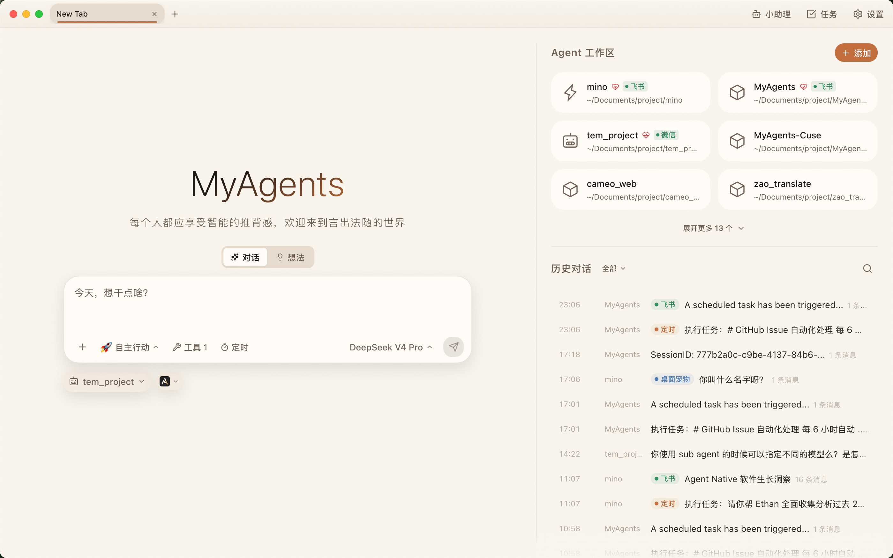
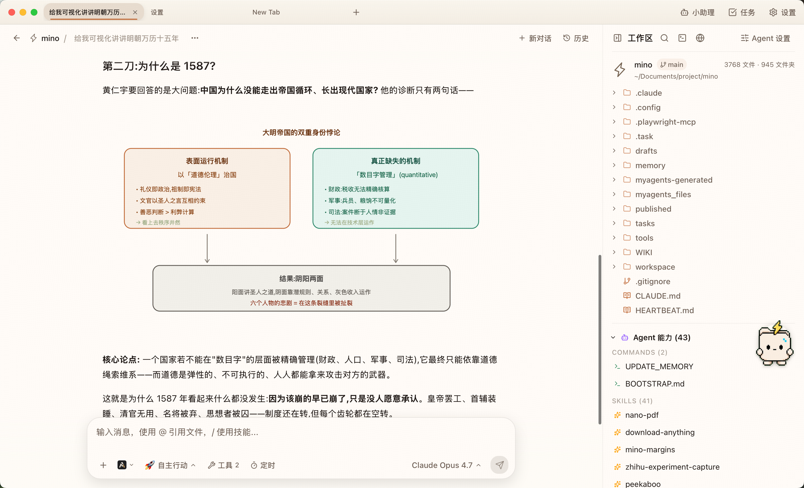
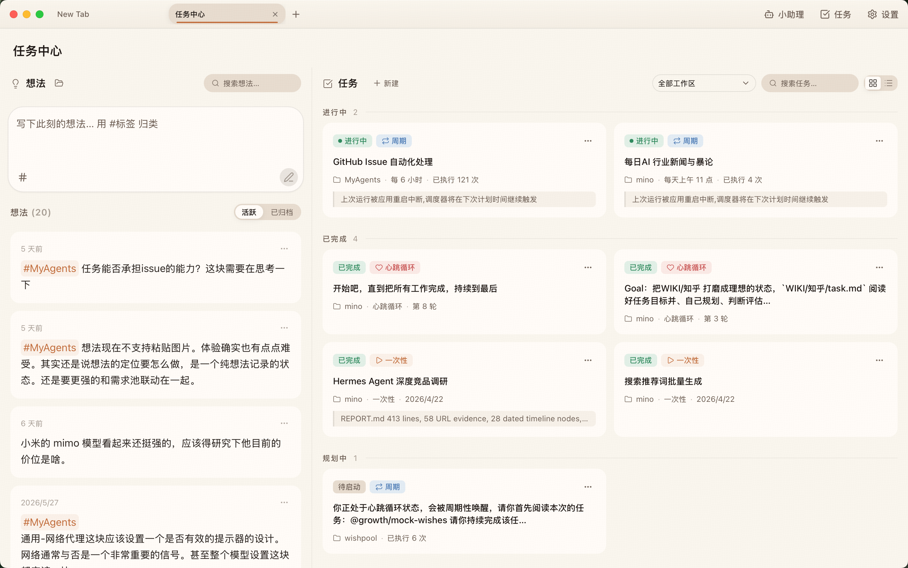
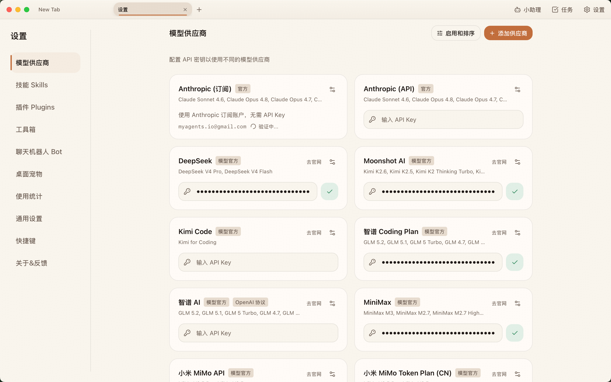
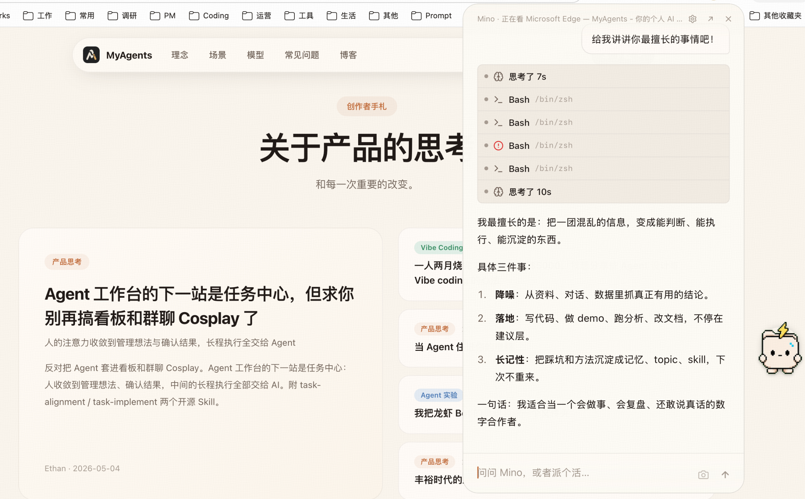

<div align="center">

# MyAgents

**活在你的电脑里，真正能干活的个人 Agent**

[中文](#chinese) · [English](#english) · [官网](https://myagents.io) · [下载](https://myagents.io) · [架构文档](specs/ARCHITECTURE.md) · [贡献指南](CONTRIBUTING.md)

[](LICENSE)
[](https://www.apple.com/macos/)
[](https://www.microsoft.com/windows/)
[](https://tauri.app/)
[](https://react.dev/)



</div>

<a id="chinese"></a>

## MyAgents 是什么

MyAgents 是一款开源桌面端个人 Agent 工作台。它不是另一个聊天窗口，而是把对话、工作区、文件、工具、模型、任务和长期记忆放进同一个桌面系统里，让 AI 真正进入你的日常工作流。

你可以把它理解成三件事的组合：

- **一个本地优先的 Agent 桌面客户端**：多标签页、工作区文件树、内嵌终端、内嵌浏览器、历史会话和本地全文搜索都在同一个窗口里。
- **一个可持续工作的任务系统**：想法可以沉淀成任务，任务可以被周期调度，执行状态可以被追踪和复盘。
- **一个开放的 AI 运行环境**：支持多模型供应商、MCP、Skills、自定义 Agent、IM Bot、插件和外部 Runtime。

最终目标很简单：让人把注意力放在判断、品味和验收上，把上下文整理、工具调用、长程执行和重复工作交给 Agent。

## 核心体验

### 从工作区开始，而不是从空聊天开始

每个 Agent 都绑定真实工作区。对话不再漂浮在一个孤立输入框里，AI 可以围绕文件、命令、技能、工具和历史上下文持续工作。



在一个会话里，MyAgents 同时提供：

- Chrome 风格多标签页，每个 Tab 独立运行一个 Agent。
- 工作区文件树、文件预览、Git 分支、Skills 和命令入口。
- 右侧分屏的内嵌终端和内嵌浏览器，方便边执行边验证。
- `@` 引用文件、`/` 调用技能、MCP 工具调用、定时任务入口和模型选择。

### 把想法收束成任务

MyAgents 内置「想法 + 任务中心」。你可以先把零散念头记下来，再和 AI 讨论、对齐目标、沉淀成可执行任务。长期任务不需要留在聊天记录里翻找，而是进入可追踪的状态机。



任务中心支持：

- 想法速记、标签归类和归档。
- 一次性任务、周期任务和 Cron 表达式。
- 任务状态、运行次数、执行日志和异常恢复。
- Chat、AI 工具、IM Bot、后台任务共享同一套调度能力。

### 模型、工具和能力由你选择

MyAgents 不把用户锁死在单一模型或单一供应商里。你可以使用 Anthropic 订阅或 API，也可以配置 DeepSeek、Moonshot、智谱、MiniMax、Google Gemini、火山方舟、硅基流动、ZenMux、OpenRouter、小米 MiMo、阿里云百炼等供应商。实际模型列表以应用内「模型供应商」页为准。



除了模型，MyAgents 还支持：

- **MCP**：STDIO / HTTP / SSE 三种接入方式，连接外部工具和数据源。
- **Skills**：把稳定流程沉淀成可复用能力，支持内置技能和用户自定义技能。
- **自定义 Agent**：为不同工作区配置不同 Prompt、模型、工具和权限。
- **外部 Runtime（实验室）**：除内置 Claude Agent SDK 外，可选择 Claude Code CLI、OpenAI Codex CLI、Google Gemini CLI 驱动会话。
- **插件与 Channel**：内置 Telegram / 钉钉，更多 IM 平台可通过 OpenClaw 插件接入。

### AI 不只活在主窗口里

桌面 AI 不应该只在你打开主应用时才存在。MyAgents 提供小助理、桌面宠物/浮窗、IM Bot 和定时任务，让 Agent 能在不同入口里承接同一个工作上下文。



你可以在主窗口里做长对话，也可以在桌面浮窗里快速发问；可以让 Agent 在 IM 里处理消息，也可以让它按计划自动执行任务。MyAgents 关注的不是「多一个聊天入口」，而是让 AI 能进入真实的工作节奏。

## 产品理念与思考

### Agent 不应该只是聊天记录

过去很多 AI 产品把「对话」当成唯一形态。对话很自然，但它不适合承载长期工作：上下文会散、任务会丢、结果难复盘，最后用户又回到手工整理。

我更希望 MyAgents 把 Agent 看成一个持续工作的系统。聊天只是入口，真正重要的是工作区、文件、工具、任务、状态和记忆。一个 Agent 应该能知道自己在哪个项目里、正在做什么、上次做到哪里、下一步该验证什么。

### 人的注意力应该收束到判断和验收

AI 最有价值的地方不是替人多生成几段文字，而是把混乱信息整理成可判断、可执行、可沉淀的东西。

所以 MyAgents 里有想法和任务中心。想法用于收集不成熟的判断，任务用于承载已经确认的目标。中间的讨论、计划、执行、验证都可以交给 Agent，但最后的方向感和验收标准仍然留给人。

### 好的桌面 Agent 应该贴近电脑本身

一个桌面 Agent 不应该只复制网页聊天体验。它应该能接触本地文件、终端、浏览器、通知、定时任务、IM 和系统环境，同时保持边界清晰、权限可控、数据本地优先。

MyAgents 的很多设计都来自这个判断：本地工作区是一等公民，Sidecar 按 Session 隔离，所有文件能力走 Tauri/Rust，AI Runtime 可以切换，模型供应商可以替换，工具和 Skills 可以扩展。

### 开放比封闭更适合 Agent 时代

Agent 产品不可能预设所有人的工作流。开发者、创作者、研究者、产品经理、教育工作者和行业专家需要的能力都不一样。与其做一个「什么都内置但什么都固定」的应用，不如提供一个稳定的底座，让用户把自己的工具、模型、技能和自动化流程接进来。

这也是 MyAgents 坚持开源、支持 MCP、Skills、插件和多供应商的原因。

## 功能概览

| 能力             | 说明                                                                 |
| ---------------- | -------------------------------------------------------------------- |
| 多标签 Agent     | 每个 Tab 独立会话和 Sidecar，适合并行工作                            |
| 工作区系统       | 文件树、预览、搜索、Git 分支、Skills 和命令统一入口                  |
| 多模型供应商     | Anthropic 订阅/API、多家国内外 API、OpenRouter/ZenMux 等聚合服务     |
| 多 Agent Runtime | 内置 Claude Agent SDK，可选 Claude Code CLI / Codex CLI / Gemini CLI |
| MCP 工具         | 支持 STDIO / HTTP / SSE，内置和外部 MCP 可并存                       |
| Skills           | 内置技能、用户技能、工作区技能，适合沉淀固定流程                     |
| 任务中心         | 想法、任务、周期调度、状态追踪和执行审计                             |
| IM Bot / Channel | Telegram、钉钉、OpenClaw 插件 Channel                                |
| 内嵌终端         | xterm.js + portable-pty，绑定当前工作区                              |
| 内嵌浏览器       | Tauri 多 Webview 子视图，方便预览链接和本地 HTML                     |
| 本地全文搜索     | Tantivy + jieba，检索会话历史和工作区文件                            |
| 本地优先         | 会话、任务、配置和生成产物默认保存在本机                             |

## 研发指引

MyAgents 是一个桌面端 AI Agent 产品，不是单纯的前端项目。改动前建议先判断你碰到的是 UI、Rust 桌面层、Node Sidecar、Agent Runtime、MCP、任务中心还是插件桥接。

### 技术栈

| 层级         | 技术                                                                       |
| ------------ | -------------------------------------------------------------------------- |
| 桌面框架     | Tauri v2 + Rust                                                            |
| 前端         | React 19 + TypeScript + Vite + TailwindCSS                                 |
| 后端 Sidecar | Node.js v24 + Claude Agent SDK                                             |
| 通信         | Rust HTTP/SSE Proxy，前端通过 Tauri invoke 代理到 Sidecar                  |
| Runtime      | 内置 Claude Agent SDK，实验室支持 Claude Code CLI / Codex CLI / Gemini CLI |
| 工具生态     | MCP、Skills、OpenClaw Plugin Bridge、`myagents` CLI                        |
| 搜索         | Tantivy + tantivy-jieba                                                    |
| 终端         | portable-pty + xterm.js                                                    |

### 环境要求

最终用户：

- macOS 13.0 Ventura 或更高版本，支持 Apple Silicon 和 Intel。
- Windows 10 或更高版本。

开发者：

- Node.js `>=22.0.0`，推荐 Node.js 24。
- npm，仓库当前声明 `npm@11.13.0`。
- Rust 通过 [rustup](https://rustup.rs) 安装，实际 toolchain 由 [rust-toolchain.toml](rust-toolchain.toml) 固定。
- macOS 13+ / Windows 10+ / Linux Ubuntu 22.04+ 或 Debian 12+。

### 本地开发

macOS / Linux：

```bash
git clone https://github.com/hAcKlyc/MyAgents.git
cd MyAgents
./setup.sh
./start_dev.sh
```

Windows：

```powershell
git clone https://github.com/hAcKlyc/MyAgents.git
cd MyAgents
.\setup_windows.ps1
.\build_windows.ps1
```

`setup.sh` 会准备内置 Node.js runtime、安装依赖并拉取默认工作区 `mino`。如果你没有 GitHub SSH key，`openmino` 的 SSH clone 可能失败；可以先配置 GitHub SSH，或手动把默认工作区准备到仓库根目录的 `mino/` 后重新运行。

### 常用命令

```bash
# 启动开发环境
./start_dev.sh

# 类型检查
npm run typecheck

# Lint，包含 ESLint 和 dependency-cruiser 架构边界检查
npm run lint

# 测试分层
npm run test:classification  # server 测试命名/分层 guard
npm run test:unit            # 纯逻辑快池
npm run test:dom             # React/jsdom 组件与 hook
npm run test:integration     # CI-safe 后端集成池，无真实网络/密钥
npm test                     # classification + unit + dom + integration
npm run test:credentialed    # 真实 Provider/SDK smoke，显式本地运行

# Debug 构建，含 DevTools
./build_dev.sh

# macOS 生产构建
./build_macos.sh

# Linux AppImage + deb 构建
./build_linux.sh
```

Linux 构建机需要 Tauri/WebKit 相关系统依赖，Ubuntu/Debian 可参考：

```bash
sudo apt-get install -y \
  build-essential libssl-dev libgtk-3-dev libayatana-appindicator3-dev \
  librsvg2-dev libwebkit2gtk-4.1-dev patchelf
```

### 项目结构

```text
src/renderer/                 React 前端
src/server/                   Node.js Sidecar
src/server/plugin-bridge/     OpenClaw Plugin Bridge
src/cli/                      myagents CLI
src/shared/                   前后端共享类型
src-tauri/                    Tauri Rust 层
bundled-agents/               内置 Agent
bundled-skills/               内置 Skills
specs/                        架构、设计、技术文档
```

### 关键架构原则

- **Session : Sidecar = 1 : 1**：每个会话最多一个 Sidecar，Tab、CronTask、BackgroundCompletion、Agent 通过 Owner 模型共享生命周期。
- **Tab-Scoped 隔离**：Chat Tab 内使用 tab-scoped API；Settings 和 Launcher 使用 Global Sidecar。
- **前端 HTTP/SSE 走 Rust 代理**：WebView 不直接访问 Sidecar 端口。
- **工作区文件 IO 走 Tauri/Rust**：文件树、读写、搜索、打开、watcher 不走 Sidecar HTTP。
- **配置写盘 disk-first**：多进程共享配置必须读磁盘最新值再合并写入。
- **Runtime 分流明确**：外部 Runtime 走 `external-session.ts`，不能让 builtin SDK resume 外部会话。

完整架构请读 [specs/ARCHITECTURE.md](specs/ARCHITECTURE.md)。具体模块请按需阅读：

- [Sidecar 冷启动](specs/tech_docs/sidecar_cold_start.md)
- [Session 架构](specs/tech_docs/session_architecture.md)
- [Multi-Agent Runtime](specs/tech_docs/multi_agent_runtime.md)
- [任务中心](specs/tech_docs/task_center.md)
- [Plugin Bridge](specs/tech_docs/plugin_bridge_architecture.md)
- [MCP / Pit-of-Success](specs/tech_docs/pit_of_success.md)
- [CLI 架构](specs/tech_docs/cli_architecture.md)
- [设计系统](specs/DESIGN.md)

### 贡献前检查

提交前至少运行：

```bash
npm run typecheck
npm run lint
npm run test:classification
npm run test:unit
```

后端 Session、Runtime、IO 或安全边界改动还应跑 `npm run test:integration`；真实 Provider / SDK 链路只在本机显式跑 `npm run test:credentialed`，不属于默认 CI。

如果改动涉及 Rust、Tauri 命令、Sidecar 生命周期、Runtime、MCP、任务中心或插件桥接，请先阅读对应 `specs/tech_docs/` 文档，避免绕开已有架构。

提交信息遵循 Conventional Commits：

```text
feat: add ...
fix: handle ...
docs: update ...
refactor: simplify ...
test: cover ...
chore: bump ...
```

<a id="english"></a>

## English

## What Is MyAgents

MyAgents is an open-source desktop workspace for personal AI Agents. It is not another chat window. It puts conversations, workspaces, files, tools, models, tasks, and long-term memory into one desktop system, so AI can become part of your real daily workflow.

You can think of it as three things in one:

- **A local-first desktop Agent client**: multi-tab conversations, workspace file trees, embedded terminal, embedded browser, chat history, and local full-text search in one window.
- **A task system for continuous work**: ideas can become tasks, tasks can be scheduled, and execution state can be tracked and reviewed.
- **An open AI runtime environment**: multi-provider models, MCP, Skills, custom Agents, IM bots, plugins, and external runtimes.

The goal is simple: keep human attention on judgment, taste, and acceptance. Let the Agent handle context gathering, tool use, long-running execution, and repetitive work.

## Core Experience

### Start From A Workspace, Not An Empty Chat

Every Agent is tied to a real workspace. The conversation does not float inside an isolated input box. The AI can keep working around files, commands, skills, tools, and historical context.


Inside one session, MyAgents gives you:

- Chrome-style tabs, with each Tab running an independent Agent.
- Workspace file tree, file preview, Git branch, Skills, and command entry points.
- Embedded terminal and embedded browser in the right split panel, so you can execute and verify in place.
- `@` file references, `/` skill invocation, MCP tool calls, scheduled tasks, and model selection.

### Turn Ideas Into Tasks

MyAgents includes an Ideas + Task Center workflow. You can first capture rough thoughts, then discuss them with AI, align on the goal, and turn them into executable tasks. Long-term work no longer has to be buried in chat history. It becomes part of a trackable state machine.


Task Center supports:

- Idea capture, tagging, and archiving.
- One-shot tasks, recurring tasks, and Cron expressions.
- Task status, run count, execution logs, and failure recovery.
- One shared scheduler across Chat, AI tools, IM bots, and background tasks.

### Choose Your Models, Tools, And Capabilities

MyAgents does not lock users into one model or one provider. You can use Anthropic subscription or API, and you can also configure DeepSeek, Moonshot, Zhipu, MiniMax, Google Gemini, Volcengine, SiliconFlow, ZenMux, OpenRouter, Xiaomi MiMo, Alibaba Cloud Bailian, and more. The actual model list is shown inside the in-app Model Providers page.


Beyond models, MyAgents supports:

- **MCP**: STDIO / HTTP / SSE integrations for external tools and data sources.
- **Skills**: reusable workflows as built-in, user-level, or workspace-level capabilities.
- **Custom Agents**: different prompts, models, tools, and permission settings per workspace.
- **External runtimes (Lab)**: in addition to the built-in Claude Agent SDK, sessions can be driven by Claude Code CLI, OpenAI Codex CLI, or Google Gemini CLI.
- **Plugins and Channels**: built-in Telegram / DingTalk, with more IM platforms available through OpenClaw plugins.

### AI Does Not Only Live In The Main Window

Desktop AI should not exist only when the main app is open. MyAgents provides the helper agent, desktop pet/floating panel, IM bots, and scheduled tasks, so the Agent can carry the same work context across different entry points.


You can have long conversations in the main window, ask quick questions from a floating desktop panel, let an Agent handle messages in IM, or have it execute tasks on a schedule. MyAgents is not trying to add one more chat surface. It is trying to put AI into the real rhythm of work.

## Product Philosophy

### Agents Should Not Just Be Chat Logs

Many AI products treat conversation as the only shape of interaction. Conversation is natural, but it is a poor container for long-running work: context scatters, tasks disappear, results are hard to review, and users eventually return to manual organization.

I want MyAgents to treat an Agent as a continuous working system. Chat is only the entry point. What matters more is the workspace, files, tools, tasks, state, and memory. An Agent should know which project it is in, what it is doing, where it stopped last time, and what should be verified next.

### Human Attention Should Converge On Judgment And Acceptance

The most valuable part of AI is not generating a few more paragraphs. It is turning messy information into something that can be judged, executed, and preserved.

That is why MyAgents has Ideas and Task Center. Ideas capture immature thoughts. Tasks carry confirmed goals. The discussion, planning, execution, and verification can be delegated to the Agent, while direction and acceptance criteria remain with the human.

### A Good Desktop Agent Should Stay Close To The Computer

A desktop Agent should not merely copy the web chat experience. It should be able to work with local files, terminal, browser, notifications, scheduled tasks, IM, and the system environment, while keeping clear boundaries, controllable permissions, and local-first data.

Many MyAgents design choices come from this belief: local workspaces are first-class, Sidecars are isolated by Session, file operations go through Tauri/Rust, AI runtimes can be switched, model providers can be replaced, and tools and Skills can be extended.

### Openness Fits The Agent Era Better Than Lock-In

No Agent product can predefine every workflow. Developers, creators, researchers, product managers, educators, and domain experts all need different capabilities. Instead of building an app where everything is built in and fixed, MyAgents provides a stable base that lets users plug in their own tools, models, skills, and automations.

This is why MyAgents is open source and supports MCP, Skills, plugins, and multiple model providers.

## Feature Overview

| Capability          | Description                                                                         |
| ------------------- | ----------------------------------------------------------------------------------- |
| Multi-tab Agents    | Each Tab has its own session and Sidecar, suitable for parallel work                |
| Workspace system    | File tree, preview, search, Git branch, Skills, and commands in one place           |
| Model providers     | Anthropic subscription/API, many API providers, OpenRouter/ZenMux aggregators       |
| Multi-Agent Runtime | Built-in Claude Agent SDK, optional Claude Code CLI / Codex CLI / Gemini CLI        |
| MCP tools           | STDIO / HTTP / SSE support, built-in and external MCP servers can coexist           |
| Skills              | Built-in, user-level, and workspace-level Skills for reusable workflows             |
| Task Center         | Ideas, tasks, recurring schedules, state tracking, and execution audit              |
| IM Bot / Channel    | Telegram, DingTalk, and OpenClaw plugin channels                                    |
| Embedded terminal   | xterm.js + portable-pty, bound to the current workspace                             |
| Embedded browser    | Tauri multi-Webview child view for previewing links and local HTML                  |
| Local search        | Tantivy + jieba for searching session history and workspace files                   |
| Local-first data    | Conversations, tasks, config, and generated artifacts are stored locally by default |

## Development Guide

MyAgents is a desktop AI Agent product, not a plain frontend project. Before making changes, identify whether you are touching the UI, Rust desktop layer, Node Sidecar, Agent Runtime, MCP, Task Center, or Plugin Bridge.

### Tech Stack

| Layer           | Technology                                                                          |
| --------------- | ----------------------------------------------------------------------------------- |
| Desktop         | Tauri v2 + Rust                                                                     |
| Frontend        | React 19 + TypeScript + Vite + TailwindCSS                                          |
| Backend Sidecar | Node.js v24 + Claude Agent SDK                                                      |
| Communication   | Rust HTTP/SSE Proxy, with the frontend reaching Sidecar through Tauri invoke        |
| Runtime         | Built-in Claude Agent SDK, Lab support for Claude Code CLI / Codex CLI / Gemini CLI |
| Tool ecosystem  | MCP, Skills, OpenClaw Plugin Bridge, `myagents` CLI                                 |
| Search          | Tantivy + tantivy-jieba                                                             |
| Terminal        | portable-pty + xterm.js                                                             |

### Requirements

End users:

- macOS 13.0 Ventura or later, Apple Silicon and Intel supported.
- Windows 10 or later.

Developers:

- Node.js `>=22.0.0`, Node.js 24 recommended.
- npm. The repository currently declares `npm@11.13.0`.
- Rust installed through [rustup](https://rustup.rs). The actual toolchain is pinned by [rust-toolchain.toml](rust-toolchain.toml).
- macOS 13+ / Windows 10+ / Linux Ubuntu 22.04+ or Debian 12+.

### Local Development

macOS / Linux:

```bash
git clone https://github.com/hAcKlyc/MyAgents.git
cd MyAgents
./setup.sh
./start_dev.sh
```

Windows:

```powershell
git clone https://github.com/hAcKlyc/MyAgents.git
cd MyAgents
.\setup_windows.ps1
.\build_windows.ps1
```

`setup.sh` prepares the bundled Node.js runtime, installs dependencies, and pulls the default `mino` workspace. If you do not have a GitHub SSH key, the SSH clone for `openmino` may fail. Configure GitHub SSH first, or prepare the default workspace manually under `mino/` and rerun the script.

### Common Commands

```bash
# Start development environment
./start_dev.sh

# Type check
npm run typecheck

# Lint, including ESLint and dependency-cruiser architecture boundary checks
npm run lint

# Test layers
npm run test:classification  # server test naming / classification guard
npm run test:unit            # pure logic fast pool
npm run test:dom             # React/jsdom components and hooks
npm run test:integration     # CI-safe backend integration, no real network/secrets
npm test                     # classification + unit + dom + integration
npm run test:credentialed    # real provider / SDK smoke, explicit local run

# Debug build with DevTools
./build_dev.sh

# macOS production build
./build_macos.sh

# Linux AppImage + deb build
./build_linux.sh
```

Linux build machines need Tauri/WebKit system dependencies. On Ubuntu/Debian:

```bash
sudo apt-get install -y \
  build-essential libssl-dev libgtk-3-dev libayatana-appindicator3-dev \
  librsvg2-dev libwebkit2gtk-4.1-dev patchelf
```

### Project Structure

```text
src/renderer/                 React frontend
src/server/                   Node.js Sidecar
src/server/plugin-bridge/     OpenClaw Plugin Bridge
src/cli/                      myagents CLI
src/shared/                   Shared frontend/backend types
src-tauri/                    Tauri Rust layer
bundled-agents/               Built-in Agents
bundled-skills/               Built-in Skills
specs/                        Architecture, design, and technical docs
```

### Key Architecture Principles

- **Session : Sidecar = 1 : 1**: each session has at most one Sidecar. Tabs, CronTasks, BackgroundCompletion, and Agents share lifecycle through the Owner model.
- **Tab-scoped isolation**: Chat Tabs use tab-scoped APIs. Settings and Launcher use the Global Sidecar.
- **Frontend HTTP/SSE goes through the Rust proxy**: WebView does not access Sidecar ports directly.
- **Workspace file IO goes through Tauri/Rust**: file tree, reads/writes, search, open, and watcher do not use Sidecar HTTP.
- **Config writes are disk-first**: shared multi-process config must load the latest disk state before merging and writing.
- **Runtime routing must be explicit**: external runtimes go through `external-session.ts`; the builtin SDK must not resume external-runtime sessions.

Read [specs/ARCHITECTURE.md](specs/ARCHITECTURE.md) for the full architecture. Module-specific docs:

- [Sidecar cold start](specs/tech_docs/sidecar_cold_start.md)
- [Session architecture](specs/tech_docs/session_architecture.md)
- [Multi-Agent Runtime](specs/tech_docs/multi_agent_runtime.md)
- [Task Center](specs/tech_docs/task_center.md)
- [Plugin Bridge](specs/tech_docs/plugin_bridge_architecture.md)
- [MCP / Pit-of-Success](specs/tech_docs/pit_of_success.md)
- [CLI architecture](specs/tech_docs/cli_architecture.md)
- [Design system](specs/DESIGN.md)

### Before Contributing

Run at least:

```bash
npm run typecheck
npm run lint
npm run test:classification
npm run test:unit
```

For backend Session, Runtime, IO, or security-boundary changes, also run `npm run test:integration`. Real provider / SDK smoke tests live under `npm run test:credentialed` and are explicit local checks, not default CI.

If your change touches Rust, Tauri commands, Sidecar lifecycle, Runtime, MCP, Task Center, or Plugin Bridge, read the matching `specs/tech_docs/` document first so the change grows from the existing architecture.

Commit messages follow Conventional Commits:

```text
feat: add ...
fix: handle ...
docs: update ...
refactor: simplify ...
test: cover ...
chore: bump ...
```

## 许可证

MyAgents 使用 [Apache License 2.0](LICENSE) 开源。
